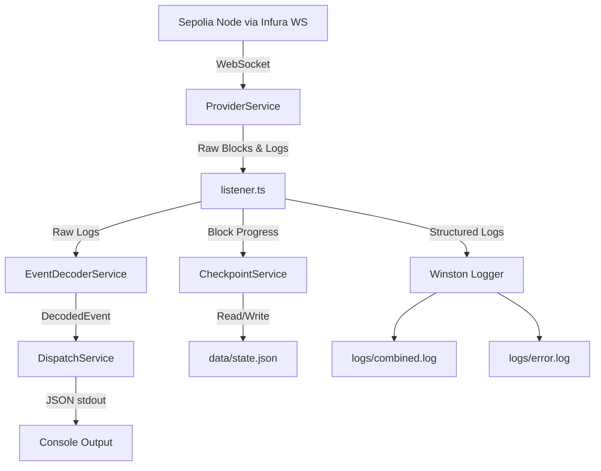

# Phase 2 Walkthrough — Event Indexer PoC

## What Was Built

A production-quality Proof-of-Concept event indexer for the **CrowdfundingPlatform** smart contract on Sepolia, located at `indexer-server/`.

### Architecture

### Files Created

| File | Purpose |
|---|---|
| [package.json](file:///c:/Users/hocky/Downloads/project/web3/indexer-server/package.json) | Dependencies & scripts |
| [tsconfig.json](file:///c:/Users/hocky/Downloads/project/web3/indexer-server/tsconfig.json) | TypeScript strict config (ES2022) |
| [.env.example](file:///c:/Users/hocky/Downloads/project/web3/indexer-server/.env.example) | Environment variable template |
| [abis/CrowdfundingPlatform.json](file:///c:/Users/hocky/Downloads/project/web3/indexer-server/abis/CrowdfundingPlatform.json) | Contract ABI (5 events) |
| [src/config/env.ts](file:///c:/Users/hocky/Downloads/project/web3/indexer-server/src/config/env.ts) | Env validation with defaults |
| [src/models/DecodedEvent.ts](file:///c:/Users/hocky/Downloads/project/web3/indexer-server/src/models/DecodedEvent.ts) | TypeScript interfaces |
| [src/utils/logger.ts](file:///c:/Users/hocky/Downloads/project/web3/indexer-server/src/utils/logger.ts) | Winston with daily-rotated file transports |
| [src/services/ProviderService.ts](file:///c:/Users/hocky/Downloads/project/web3/indexer-server/src/services/ProviderService.ts) | WS connection + exponential backoff reconnect |
| [src/services/EventDecoderService.ts](file:///c:/Users/hocky/Downloads/project/web3/indexer-server/src/services/EventDecoderService.ts) | ABI-based log parsing (BigInt→string) |
| [src/services/CheckpointService.ts](file:///c:/Users/hocky/Downloads/project/web3/indexer-server/src/services/CheckpointService.ts) | Atomic file-based state persistence |
| [src/services/DispatchService.ts](file:///c:/Users/hocky/Downloads/project/web3/indexer-server/src/services/DispatchService.ts) | Console output + rate limiting (Kafka in Phase 2) |
| [src/listener.ts](file:///c:/Users/hocky/Downloads/project/web3/indexer-server/src/listener.ts) | Main orchestrator: catch-up → live mode |
| [README.md](file:///c:/Users/hocky/Downloads/project/web3/indexer-server/README.md) | Full documentation |

### Events Monitored

- `CampaignCreated` — New campaign with projectId, creator, title, goal, deadline
- `CampaignStatusChanged` — Status transitions (Active/Funded/Failed)
- `ContributionReceived` — Contributions with amount
- `FundsWithdrawn` — Creator withdrawal
- `RefundClaimed` — Contributor refund

## Key Design Decisions

1. **Atomic Checkpoint Writes** — Write to `state.json.tmp` then rename to prevent corruption on crash
2. **Rate Limiting via Token Window** — Enforces 10 RPC calls/second for Infura free tier
3. **Confirmation Depth Buffer** — Blocks held in memory until 12 confirmations, preventing finality issues
4. **Reorg Detection** — Parent hash validation on each sync cycle; rolls back 50 blocks on mismatch
5. **Graceful Shutdown** — SIGINT/SIGTERM flush pending events and persist final checkpoint

## Verification Results

| Check | Status |
|---|:---:|
| `npm install` — 50 packages, 0 vulnerabilities | ✅ |
| `npx tsc --noEmit` — strict mode, zero errors | ✅ |
| `npm run build` — dist/ output generated | ✅ |
| All 7 source files compile | ✅ |
| dist/ contains JS + declaration maps + source maps | ✅ |

## Phase 2 Roadmap — Kafka Integration

The `DispatchService` includes a placeholder comment for Phase 2. The migration path:

1. **Add KafkaJS** dependency and Kafka broker config to `.env`
2. **Refactor `DispatchService`** to initialize a Kafka producer on startup
3. **Topic routing**: produce to `crowdfunding.events.{eventName}` (e.g., `crowdfunding.events.CampaignCreated`)
4. **Schema Registry**: register Avro schemas for each event type
5. **DLQ**: route failed messages to `crowdfunding.events.dlq`
6. **Backpressure**: implement producer buffering with `linger.ms` and `batch.size` tuning
7. **Monitoring**: add Kafka producer metrics to `getStatus()` and health checks
